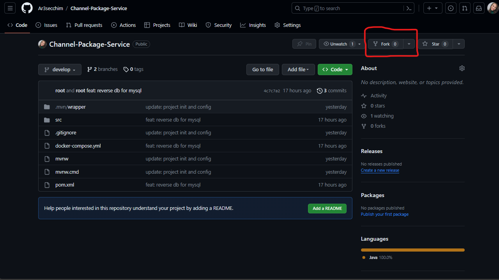

# Sistema de Operadora de Canais

O Sistema de Operadora de Canais é uma aplicação desenvolvida para permitir aos usuários a gestão de contas, assinaturas de pacotes de canais, emissão de faturas, realização de pagamentos, assinatura de promoções por tempo determinado e requisição de visitas técnicas para instalação ou manutenção de equipamentos. Esse projeto foi desenvolvido com arquitetura de micro serviço na qual cada um tem sua responsabilidade, este serviços são pacotes, assinaturas, fatura, pagamento, visita técnica e promoções;

1. Microserviço de Pacotes (este repositório se trata desse serviço)
Este microserviço lida com a gestão dos pacotes de canais oferecidos pela operadora.

## Funcionalidades

- 🪙 Visualização de Pacotes: Os usuários podem visualizar os pacotes disponíveis, detalhando os canais incluídos, preços e condições.
- 🔒 Criar pacotes com canais selecionados.
- 📦 Conversar com o micro serviço de faturas para fornecer os valores dos canais.

## Pré-requisitos

Antes de iniciar, certifique-se de ter as seguintes dependências instaladas:

- Java Development Kit (JDK) - Versão 17 ou superior.
- Maven

## Configuração

1. Criar um fork do repositorio:
*obs:* É importante que você faça o "fork" do projeto e não um "clone", se estiver com dúvidas sobre fork [leia aqui](https://docs.github.com/pt/get-started/quickstart/fork-a-repo).



O objetivo do Fork é criar uma cópia do repositório na sua conta do GitHub, permitindo que você trabalhe nele sem afetar o projeto principal. É importante lembrar que você nunca deve enviar Pull Requests diretamente para o repositório principal do projeto, pois isso não é permitido pelo sistema. Após o Fork, você terá um repositório com o seguinte nome: `seu_nome_de_usuario/Channel-Package-Service`.

2. Agora que você fez o fork do repositório, é hora de cloná-lo para sua máquina local. Para fazer isso, vá para o seu repositório recém-criado na sua conta GitHub (lembre-se de que ele deve ter o `seu_nome_de_usuario/Channel-Package-Service`). Em seguida, clique no botão "Code" e copie o link do repositório usando o botão "Copy" ao lado.

> Clonar um repositório significa baixa-lo para a sua máquina mantendo uma conexão com o GitHub

```bash
  git clone https://github.com/seu_nome_de_usuario/Channel-Package-Service
  cd Channel-Package-Service
```

3. Subir os container necessário:

```bash
  docker-compose up
```

4. Hora do pull request, após dar o git push, ao abrir o seu repositório fork na página do GitHub, você notará que existe uma mensagem logo no topo assim como essa:

Vendo isso, clique no botão "Compare & pull request", isso começara o processo de abertura de uma PR(Pull Request) e lembre se de apontar sempre para a branch dev do projeto Channerl Package Service.

Lembre se de colocar o título conforme o tipo da tarefa, uma mensagem que descreva o que você fez.

## Tecnologias Utilizadas

- 💻 Linguagem de Programação: Java 17
- 💻 Framework: Spring Boot
- 💻 Banco de dados: mySql

## Maiores Desafios

- Manipular dados;
- Aplicação de design SOLID;

## Grupo

  - Renara Secchim
  - Camila Cerqueira
  - Luciana Mendes
  - Felicianne Nogueira
  - Carol Thiengo
